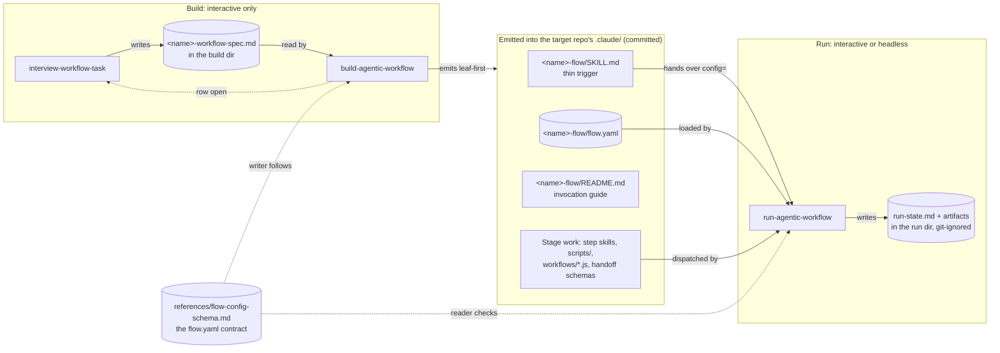
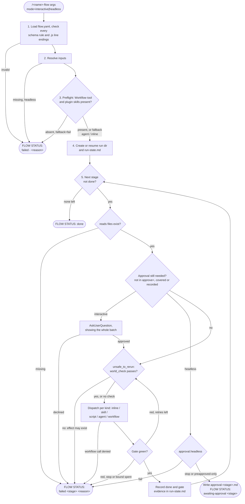
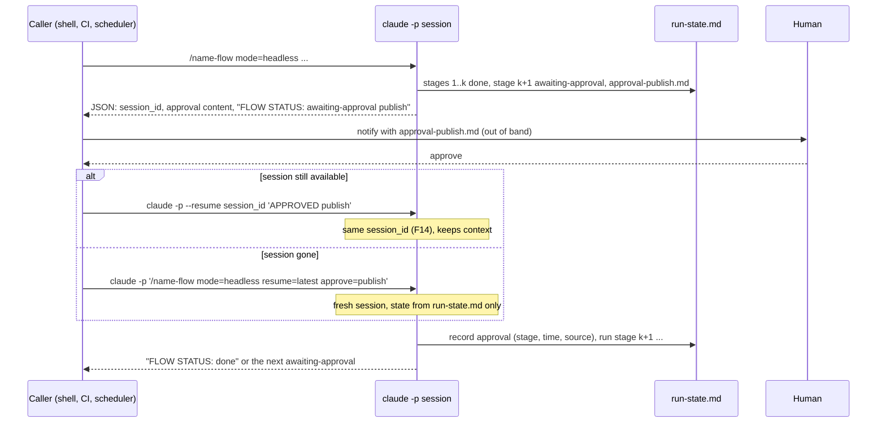

# ceh-workflow-builder: Architecture

How the plugin turns a repetitive task into a workflow that runs through Claude Code, interactively
or headless (`claude -p`), and where Claude Code's dynamic workflows fit in.

The `flow.yaml` format is specified in
[`references/flow-config-schema.md`](../references/flow-config-schema.md) and the runner in
[`skills/run-agentic-workflow/SKILL.md`](../skills/run-agentic-workflow/SKILL.md). This page shows how
they fit together; those two files are the authority on keys and statuses.

Evidence for every runtime claim marked `Fn` is in [TEST_RESULTS.md](TEST_RESULTS.md).

## Two phases, two lifetimes

| Phase     | Who drives                                          | Mode                    | Produces                                                             |
| --------- | --------------------------------------------------- | ----------------------- | -------------------------------------------------------------------- |
| **Build** | `interview-workflow-task`, `build-agentic-workflow` | Interactive only        | Files committed to the target repo                                   |
| **Run**   | `run-agentic-workflow`, following `flow.yaml`       | Interactive or headless | Run artifacts and `run-state.md` under the git-ignored run directory |

Building is interactive by construction: the interview asks the user, the intake gate refuses to
infer missing answers, and nothing is written until the user agrees to the file list. Running is the
part that must work unattended.

## Components



Every edge but the interview call-back points from build towards run, so the picture reads in the
order things happen. Only the middle column is committed.

| Component                 | Role                                                                                                                                                                                                        |
| ------------------------- | ----------------------------------------------------------------------------------------------------------------------------------------------------------------------------------------------------------- |
| `interview-workflow-task` | Asks the nine questions and writes the spec. Never answers for the user.                                                                                                                                    |
| `build-agentic-workflow`  | Gates on the spec, decides one skill vs workflow, picks a backend per step, emits leaf-first.                                                                                                               |
| `flow-config-schema.md`   | The `flow.yaml` contract. One copy, shared by builder (writer) and runner (reader) via `${CLAUDE_PLUGIN_ROOT}`.                                                                                             |
| `run-agentic-workflow`    | Generic runner: loads `flow.yaml`, preflights, walks stages, enforces gates and approvals, keeps run state.                                                                                                 |
| `<name>-flow/SKILL.md`    | Thin trigger in the target repo. Carries the moment in its `description` and `/<name>-flow`; its body only calls the runner with `config=${CLAUDE_SKILL_DIR}/flow.yaml` followed by `$ARGUMENTS` unchanged. |
| `flow.yaml`               | Stages, gates, approvals, fan-out and retry bounds for one workflow. Replaces the pipeline tables the flow skill used to carry.                                                                             |
| `<name>-flow/README.md`   | Invocation guide: the interactive and headless commands, with `--allowedTools` collected from each stage's `tools`. A skill directory's README is never loaded as context.                                  |
| `.claude/workflows/*.js`  | Optional: a stage that runs as a saved Claude Code dynamic workflow.                                                                                                                                        |

The single-skill path is unchanged: when the builder's workflow gate does not hold, it emits one
`SKILL.md` and none of the above beyond it.

## Stage backends

The runner owns ordering, gates, approvals and state. Each stage's work goes to one backend:

| `kind`     | Runs via               | Own context    | Can ask the user  | Use for                                                                                                 |
| ---------- | ---------------------- | -------------- | ----------------- | ------------------------------------------------------------------------------------------------------- |
| `inline`   | the runner itself      | no             | yes (interactive) | small steps that fit in the run's context                                                               |
| `skill`    | `Skill` tool           | no             | yes (interactive) | a step owned by an existing or generated skill                                                          |
| `script`   | `Bash`                 | n/a            | no                | mechanical, deterministic steps                                                                         |
| `agent`    | `Agent` tool           | yes            | no                | a large step, or a fan-out bounded by `max_parallel` (1-16) and `max_items`, one output file per worker |
| `workflow` | Workflow tool, by name | yes, per agent | no                | many items, cross-checking, loop-until-pass: dozens to hundreds of agents                               |

`workflow` is never assumed. The runner checks at preflight that the Workflow tool is present, and a
`skill` stage naming a plugin skill that the plugin is installed. When the capability is **absent**,
the stage runs its `fallback`: `fail` (the default), `agent` or `inline`. Without the tool, Claude
has been observed to imitate a workflow by hand and report success (F6), so imitation is forbidden.
A call that is attempted and **denied or errors** is a failed stage (`workflow-denied`), never a
fallback, because a fallback there would hide a missing permission.

Human input happens **only between stages, in the runner**. `AskUserQuestion` is stripped from
subagents, and a dynamic workflow takes no input mid-run, so an approval can never live inside an
`agent` or `workflow` stage.

### Why the runner and dynamic workflows coexist

They complement each other. The builder and runner are the design-time and orchestration layer:
intake, gates, re-run safety, irreversible steps, secrets. A dynamic workflow is a runtime for
large fan-out, cross-checking and loop-until-pass inside one stage. Each does something the other
cannot:

| Skill-driven flow (the runner)                      | Dynamic workflow (a stage backend)                                   |
| --------------------------------------------------- | -------------------------------------------------------------------- |
| Human confirmations and go/no-go gates              | Dozens to hundreds of agents (16 concurrent by default, 1,000 a run) |
| Re-run safety (spec Q8) and irreversible steps (Q9) | Control flow enforced by the script, not by Claude following prose   |
| Run state on disk that survives sessions            | Adversarial cross-checks, with results kept out of Claude's context  |
| Secrets passed by reference                         | Resume of a stopped run (same session, `--resume`, or backgrounded)  |

A workflow's _checks_ are still agents running commands and reporting against a schema. The script
enforces the order and the loop, not the truth of the check.

## How a run proceeds



The numbers match the steps in the runner's procedure. A retry goes back through the world check,
because the runner re-runs `world_check` before every attempt. A stage pre-approved with `approve=`
takes the `no` branch at the approval check, so `preapproved-only` without it stops.

The final `FLOW STATUS:` line is written to `run-state.md` too, so a headless caller can branch on
either the reply or the file. Failures before any stage runs use `-` as the stage id. A declined
approval ends as `failed <stage> declined` with the stage left `pending`, so a resumed run asks again.
`on_fail: retry` is not allowed on a stage with an `approval` or a `fan_out`, so a retry can never
fire an irreversible step or a whole fan-out twice.

## Interactive vs headless

The mode is an explicit launch argument, default `interactive`. A skill cannot reliably detect it
is headless, and guessing wrong either hangs on a question nobody can answer or skips a
confirmation.

| Concern                           | Interactive                            | Headless (`claude -p`)                                                                              |
| --------------------------------- | -------------------------------------- | --------------------------------------------------------------------------------------------------- |
| Start                             | the moment, or `/<name>-flow`          | `claude -p '/<name>-flow mode=headless ...'` — skill slash commands work (F11)                      |
| Approval before a stage           | `AskUserQuestion`                      | `headless: stop` writes `approval-<stage>.md` and ends at `awaiting-approval`; resumed later        |
| Resume a stopped run              | asks: resume or new                    | `resume=latest` or `new` (default `new`)                                                            |
| Workflow tool                     | Pro: `/config` → Dynamic workflows     | `--settings '{"enableWorkflows": true, "disableWorkflows": false}'` (F5, F8)                        |
| Launching a saved workflow        | runner calls the Workflow tool by name | same; `/<workflow-name>` does **not** work in `-p` (F9)                                             |
| Workflow launch permission        | approval dialog                        | `--allowedTools 'Workflow(<name>)'` (F12)                                                           |
| Tool permissions for agents       | prompted mid-run                       | nobody to prompt: each stage lists its `tools`, and the builder collects them into `--allowedTools` |
| Usage limit hit inside a workflow | run waits for the reset                | agents fail; stage stays `pending`, resume later                                                    |
| Watching or stopping a run        | `/workflows`                           | none; bounded by `max_parallel`, `max_items` and retry bounds in `flow.yaml`                        |
| Output for a caller               | reply text                             | `--output-format json`: `result` ends with the `FLOW STATUS:` line, plus `session_id`               |

### Headless approval loop

A headless run cannot ask, so an approval ends the session and a later invocation carries the
answer. Both continuation routes were tested (F11):



`run-state.md` is the record; `--resume` is a convenience that keeps the conversation context.
Every approval is written to the state file with its source, so a resumed run never relies on prompt
text alone. `approval-<stage>.md` holds exactly what the approval's `show` names, so the person
approving headless sees what an interactive user would have been shown. On resume the inputs come
from `run-state.md`; re-passing a different value fails the run (`inputs changed on resume`).

Example headless invocation (pwsh; Bash is the same apart from line continuation):

```powershell
claude -p '/prepublish-flow mode=headless repo=.' `
  --settings '{"enableWorkflows": true, "disableWorkflows": false}' `
  --allowedTools 'Workflow(prepublish-audit)' 'Read' 'Edit' 'Write' 'Bash(uv run pytest:*)' `
  --output-format json
```

The builder writes this command into the flow's `README.md`, with `--allowedTools` collected from
each stage's `tools`, and includes `--settings` only when a `workflow` stage exists. A flow with a
`workflow` stage requires Claude Code v2.1.269 or later. That floor comes from the documented
feature versions. The tests ran on v2.1.288, so the undocumented `enableWorkflows` behaviour (F8) is
verified only there.

## Design decisions

| Decision                                                                           | Why                                                                                                                                                      |
| ---------------------------------------------------------------------------------- | -------------------------------------------------------------------------------------------------------------------------------------------------------- |
| A generic runner skill reads `flow.yaml`, instead of compiling it to per-step code | One config drives both modes with no regeneration. A dynamic workflow cannot be the interpreter: it cannot read files or ask the user.                   |
| Dynamic workflows are a stage backend, not the orchestrator                        | They take no mid-run input, so approvals must sit between stages. One workflow per stage matches the docs' advice for sign-off between stages.           |
| Mode is an explicit argument                                                       | A skill cannot detect headless reliably.                                                                                                                 |
| No "proceed anyway" headless approval                                              | `headless:` is `stop`, `preapproved-only` or `fail`. Pre-approval is an explicit `approve=` argument, recorded in run state.                             |
| Missing Workflow tool fails or falls back, never imitates                          | Observed imitation looked like success on disk (F6).                                                                                                     |
| A denied workflow call fails the stage instead of falling back                     | A fallback would hide a missing permission behind a run that looks healthy.                                                                              |
| Fan-out declares `max_items` as well as `max_parallel`                             | Headless runs have no `/workflows` view to stop them, so the config bounds the cost.                                                                     |
| No `on_fail: retry` on a stage with an approval or a fan-out                       | A retry must never fire an irreversible step or a whole fan-out a second time.                                                                           |
| Explicit `--settings` and `--allowedTools` on every headless run                   | `enableWorkflows` is undocumented (F8), and a launch allowed without a rule was likely machine-specific (F12). Explicit flags make the run reproducible. |
| The runner lives in the plugin, not vendored into each target repo                 | One copy, updated with the plugin. Generated flows declare the plugin in `compatibility`.                                                                |
| Workflow `.js` is written with LF and pinned by `.gitattributes`                   | CRLF makes the launch fail (F2).                                                                                                                         |
| Building stays interactive-only                                                    | The intake must not infer answers, and emission needs the user's agreement to the file list.                                                             |

## Risks

- **`enableWorkflows` is undocumented** (F8) and may change. The version floor and the runner's
  preflight catch a missing tool.
- **Dynamic workflows move fast.** Features arrived across versions: `/workflow-authoring` in
  v2.1.248, the concurrency environment variable in v2.1.269, waiting out a usage limit in v2.1.271.
- **Token cost.** On Pro the default workflow size guideline is `small` and the usage limit is reached
  quickly, so start a `workflow` stage on a small slice.
- **Generated flows need this plugin** wherever they run, because the runner is not vendored.

## Not yet validated

The design was tested piece by piece (TEST_RESULTS.md), not end to end. Still open: pilot one real
fan-out task through a built flow, interactively and then headless, and compare an `agent` fan-out
stage with a `workflow` stage on the same task.
